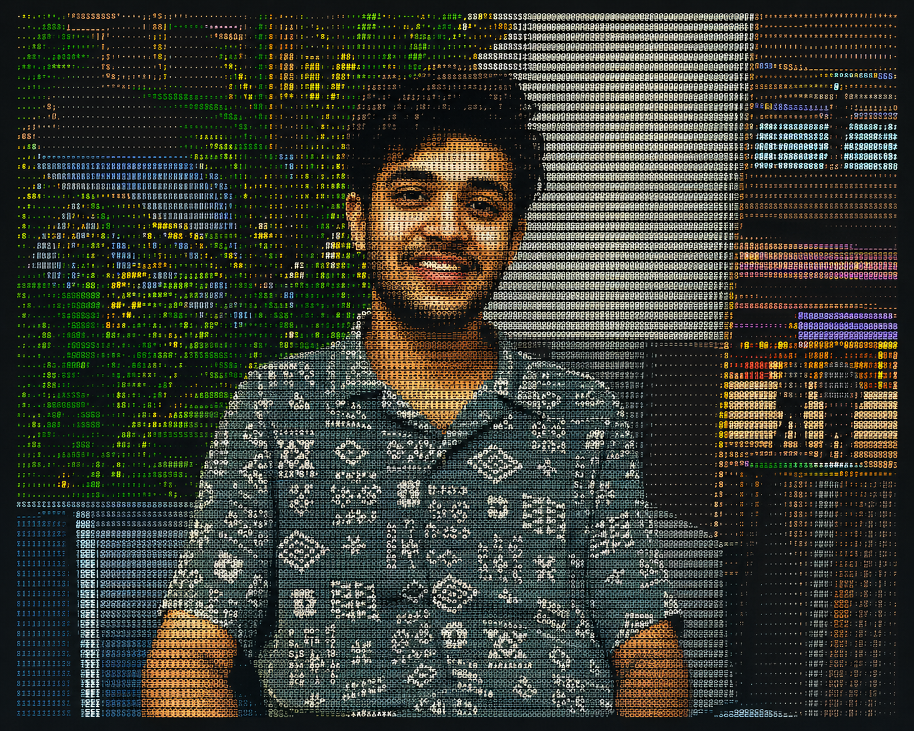

<div align="center">



# 👋 Hi, I'm Divyadarshee Dash

### AI/ML Research Student · Human-Centered Intelligence · Multimodal & Embodied AI

**B.Tech CSE (AI/ML) · Research Experience at IIT Patna · Aspiring AI Researcher**

[](https://www.linkedin.com/in/divyadarshee-dash/)
[](https://github.com/DivyadarsheeDash)
[](https://twitter.com/Divyadarshee_D)

</div>

---

## 🔬 Research Identity

I am an **AI/ML student and aspiring researcher** interested in a fundamental question:

> **How can we build AI systems that understand, reason, adapt, and act with greater human-like flexibility in complex real-world environments?**

My interests lie at the intersection of **machine learning, deep learning, multimodal intelligence, human-centered AI, computer vision, autonomous agents, robotics, and embodied intelligence**.

I am particularly interested in systems that can go beyond pattern recognition—systems capable of combining **perception, reasoning, memory, planning, interaction, and continuous learning**.

My existing projects are rooted in applied AI for real-world systems. I am now building on that foundation to move toward research in **generalizable intelligence, multimodal reasoning, human-AI collaboration, and autonomous decision-making**.

---

## 🧭 Research Interests

- **Human-centered and human-compatible AI**
- **Commonsense, grounded, and causal reasoning**
- **Multimodal learning across language, vision, and interaction**
- **Embodied AI, robotics, and autonomous systems**
- **Autonomous agents and long-horizon planning**
- **Computer vision and representation learning**
- **Human-AI collaboration and interactive intelligence**
- **Robust learning under limited data and distribution shifts**
- **Trustworthy, interpretable, and uncertainty-aware AI**

---

## 🤖 Research Vision

I want to contribute to AI systems that can:

```text
Perceive the world
        ↓
Build useful representations
        ↓
Reason using context and prior knowledge
        ↓
Plan toward long-term objectives
        ↓
Interact naturally with humans
        ↓
Act safely in physical or digital environments
        ↓
Learn continuously from feedback
