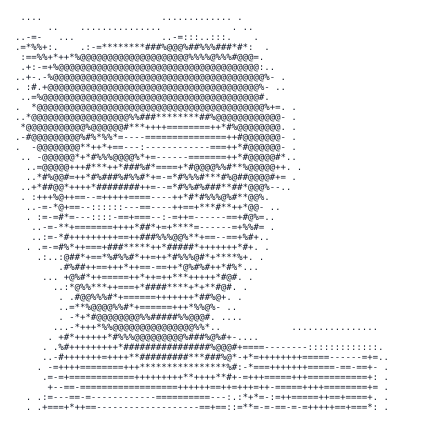

<div align="center">

<picture>
  <source media="(prefers-color-scheme: dark)" srcset="./assets/divyadarshee_ascii_dark.svg">
  <source media="(prefers-color-scheme: light)" srcset="./assets/divyadarshee_ascii_light.svg">
  
</picture>

# 👋 Hi, I'm Divyadarshee Dash

### AI/ML Research Student · Physics-Guided Intelligence · Deep Learning for Real Systems

**B.Tech CSE (AI/ML) · Research experience at IIT Patna · Building toward a research career**

</div>

---

## 🔬 Research Identity

I am an **AI/ML student and aspiring researcher** focused on a difficult but meaningful question:

> **How can intelligent models remain accurate, explainable, and dependable when they leave the notebook and enter a real physical system?**

My work sits at the intersection of **machine learning, deep learning, industrial intelligence, digital twins, fault diagnosis, computer vision, and control systems**. I am especially interested in combining **data-driven learning with physical knowledge**, rather than treating models as black boxes.

I do not want to build models that only produce impressive training scores. I want to build systems that can survive **noise, limited sensors, class imbalance, unseen operating conditions, and honest evaluation**.

---

## 🧭 Research Direction

- **Physics-guided machine learning** for engineering systems  
- **Fault detection, diagnosis, severity estimation, and health monitoring**  
- **Digital twins and residual-based intelligent monitoring**  
- **Deep learning for computer vision and re-identification**  
- **AI-assisted motor drives, power electronics, and control systems**  
- **Reliable evaluation, uncertainty awareness, and reproducible experimentation**

---

## 🧪 Research Projects

| Project | Research Goal |
|---|---|
| **SEDT-Net** | Physics-guided self-evolving digital-twin framework for fault classification, health estimation, and predictive intelligence in inverter-fed motor systems |
| **PRISM-FD** | Minimal-instrumentation leak detection using physics-informed residuals and statistical monitoring for PLC/HMI-based industrial setups |
| **ANN-DTC** | Neural-network-assisted direct torque control for a closed-end winding induction motor |
| **Jaguar Re-Identification** | Metric-learning and deep-embedding methods for identifying individual jaguars under viewpoint variation and class imbalance |
| **PMSM FOC Research** | Mathematical modelling, controller analysis, and SPWM/SVPWM-oriented investigation of permanent-magnet synchronous motor drives |

---

## 🧠 What I Care About

```text
Real data        > polished toy demonstrations
Honest validation > inflated accuracy claims
Physical insight  + machine learning
Reproducibility   + clear engineering reasoning
Research depth    > unnecessary complexity
```

My aim is to turn each project into a **defensible research contribution**—with a clear problem statement, meaningful baselines, ablation studies, failure analysis, and results that can withstand serious review.

---

## 🛠️ Technical Stack

### Languages and Scientific Computing
`Python` · `NumPy` · `Pandas` · `SciPy` · `Matplotlib`

### Machine Learning
`scikit-learn` · `XGBoost` · `LightGBM` · feature engineering · model selection · calibration · explainability

### Deep Learning
`PyTorch` · neural networks · CNNs · embeddings · metric learning · optimization

### Engineering and Simulation
`MATLAB` · `Simulink` · motor-drive modelling · control systems · digital-twin workflows

### Research Workflow
`Jupyter Notebook` · `Git` · `GitHub` · experiment tracking · technical writing · reproducible evaluation

---

## 📌 Current Focus

- Converting engineering problems into **research-grade AI pipelines**
- Improving my command of **PyTorch, computer vision, and representation learning**
- Designing **physics-aware and uncertainty-aware models**
- Writing cleaner, more reproducible, and reviewer-defensible experiments
- Preparing for **competitive global research internships and a future PhD**

---

## 🎯 Long-Term Goal

My long-term goal is to become a researcher who can move confidently across:

```text
Physical system → mathematical understanding → data pipeline
→ intelligent model → rigorous evaluation → deployable solution
```

I am still learning, but I take the process seriously. Every repository here represents an attempt to understand the problem more deeply, build more carefully, and move one step closer to high-impact research.

---

## 🌐 Connect With Me

<p align="left">
  <a href="https://twitter.com/Divyadarshee_D"><b>Twitter / X</b></a>
  &nbsp;•&nbsp;
  <a href="https://www.linkedin.com/in/divyadarshee-dash/"><b>LinkedIn</b></a>
  &nbsp;•&nbsp;
  <a href="https://github.com/DivyadarsheeDash"><b>GitHub</b></a>
</p>

---

<div align="center">

### “Build with evidence. Improve without ego. Compete with preparation.”

⭐ Explore the repositories, examine the experiments, and star any project you find valuable.

</div>
